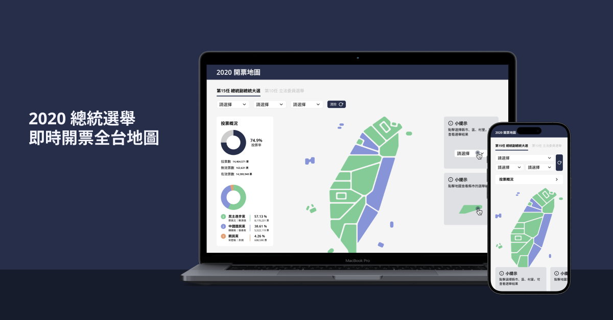

<div align="center">

# 總統即時開票全台地圖



</div>

[Demo](https://test1227-dbafe.web.app/)

其他專案：
[JTown | THE BIGGEST NBA STORE](https://snowman12320.github.io/jtown-vite/#/)
 / [原始碼](https://github.com/snowman12320/F2E-nuxt3/tree/main)

## 作品說明

這個網站是一個為台灣人提供歷史選舉和區域統計數據的資訊平台。透過直觀的圖表，使用者可以輕鬆檢視市、區、里的歷史數據分布，包括人口統計和總統歷史大選資訊。

## 系統說明

**版本**

專案在 Node.js `v18.18.0` 環境下進行開發。

**專案運行**

您可以按照以下步驟運行專案：

```shell
// pnpm
pnpm install
pnpm run dev
```
```shell
// or npm
npm install
npm run dev
```

安裝所有必要的相依套件，並啟動開發伺服器，能夠開始開發和預覽專案。

## 資料夾說明

```shell
├── assets/           # 放需要經過 webpack 處理的資源，例如需要經過預處理器（如 Sass 或 Babel）處理的樣式表或 JavaScript 文件。當你在 Vue 檔案中使用相對路徑引用 assets 目錄中的資源時，該路徑會被 webpack 處理並轉換為最終的路徑。
├── components/       # 件是應用的構建塊，可以被重複使用在不同的部分和頁面，不需import即可使用。
├── layouts/          # 用於存放應用的佈局模板。佈局是用來改變頁面的外觀和行為的一種方式。
├── middleware/       # 用於存放應用的中間件。中間件讓你可以定義一個自定義函數，該函數將在一頁或一組頁面（佈局）渲染之前運行。
├── pages/            # 用於存放應用的視圖和路由。Nuxt.js 讀取所有的 .vue 檔案並自動創建應用的路由配置。
├── plugins/          # 用於存放需要在根 Vue.js 應用實例化之前運行的 JavaScript 插件。
├── composables/      # 包含 Vue 3 的 Composables，這些是可重用的功能或狀態管理元件。
├── public/           # 存放不需要經過任何處理，並且在應用運行時可以被公開訪問的資源，例如圖片、字體或 .html 文件。這些資源在建立應用時會被複製到輸出目錄，並且在應用運行時可以直接通過 URL 訪問。
├── server/           # 包含伺服器端的程式碼，例如 API 端點、資料庫連接等。
├── app.vue           # 應用程式的主應用程式元件。
├── error.vue         # 錯誤訊息渲染元件。
├── tsconfig.json     # TypeScript的設定文件，用於指定專案的編譯選項。
├── package.json      # 專案的npm套件設定文件，包含了專案依賴和腳本。
└── README.md         # 包含項目的簡要描述和使用說明的自述文件。
```

## 使用技術

**前端框架與函式庫**

- Vue.js：前端開發框架，用於建立使用者介面和應用程式的元件。
- axios: Axios 是一個簡單的基於 Promise 的 HTTP 客戶端，適用於瀏覽器和 Node.js。
- VueUse: 提供各種實用的 Vue Composables 函數的庫。這些 Composables 函數可以在 Vue 應用中重複使用，以提供各種功能，如狀態管理、側效處理、工具函數等。
- nuxt-lodash：Nuxt.js 的模塊，它允許你在你的 Nuxt.js 應用中使用 lodash 函數庫。lodash 是一個 JavaScript 工具庫，提供了許多有用的工具函數

**樣式**

- Tailwind CSS：用於開發網頁和網頁應用的 CSS 框架。

**元件庫**

- naive-ui: 這是一個 Vue 3 組件庫，提供了一套實用且自由度高的組件。
- nuxt-icon: 這是一個用於 Nuxt.js 的模塊，可以自動生成各種大小和類型的應用圖標。
- vue-chartjs: 這是一個基於 Chart.js 的 Vue.js 包裝器，允許你在 Vue.js 應用中輕鬆創建可重用的圖表組件。

**建置工具**

- Nuxt3：用於加速前端開發、建置SEO最佳化、後端API、串接資料庫的建置工具。

**類型系統**

- Typescript：提供靜態型別檢查，提高程式碼品質和開發效率。

**程式碼風格**

- ESLint：用於檢查程式碼是否符合規範的工具。
- Prettier：用於自動格式化程式碼的工具。

**部署和託管**

<!-- - gh-pages：用於將應用程式部署到 GitHub Pages，以便在線上示範和分享專案。 -->
- firebase-tools: Firebase CLI 是一個命令列工具，可讓您與 Firebase 服務進行交互。您可以使用它來部署到 Firebase Hosting，以及在本地開發和測試 Firebase 雲功能。
<!-- - vercel：用於將應用程式部署到 Vercel，以便在線上示範和分享專案。 -->

**版本控制**

- Git：用於版本控制。
  
**其他**

- pnpm：用於安裝和管理專案相依套件的工具。與 npm 和 yarn 類似，但提供更高效的存儲策略，可以共享相同版本的套件，而不是每個專案都單獨存儲一份。
- Figma: 用於設計和共享網站設計的工，允許團隊成員共享和協作設計。
- nuxt/devtools：這是一個 Nuxt.js 的開發工具，可以幫助開發者更好地理解和調試他們的 Nuxt.js 應用。
  
**資料**

- 使用選舉及公投資料庫 API
  - https://db.cec.gov.tw/ElecTable/Election?type=President

## 預計導入

**測試框架**

- Firebase：具有現成API的雲服務，提供各種靜態儲存、資料庫、部屬、會員系統、發信功能，有助前端輔助開發。
- jest：一個簡單的 JavaScript 測試框架，用於測試 Vue.js 元件。

## 相關連結

- [設計稿(Designed by yuni)](https://www.figma.com/file/Caoi6yMxwbeKMneS5tsCt6/開票地圖?type=design&node-id=66%3A3043&mode=design&t=5N4mw68gAfagODaM-1)
